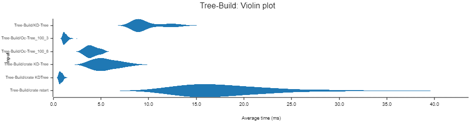
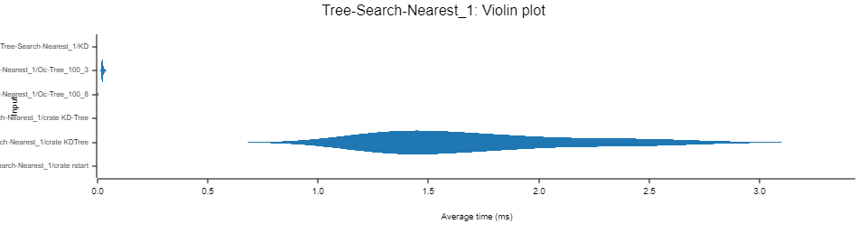
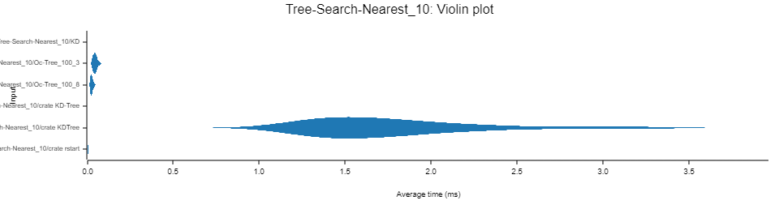
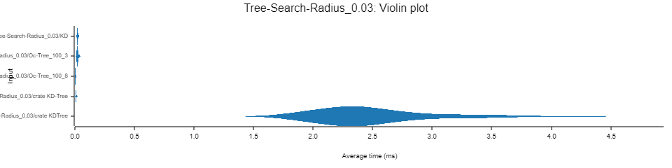
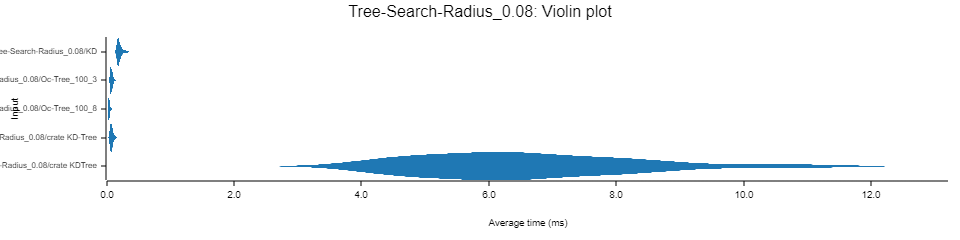

# Bench Nearest Neighbors
## crates:
- [f3l_search_tree::KdTree](https://github.com/Donvlouss/f3l/tree/main/crates/f3l_search_tree)
- [f3l_search_tree::OcTree](https://github.com/Donvlouss/f3l/tree/main/crates/f3l_search_tree)
- [KDTree](https://crates.io/crates/kdtree)
- [KD-Tree](https://crates.io/crates/kd-tree)
- [rstart](https://crates.io/crates/rstar)
  
[kiddo](https://crates.io/crates/kiddo) seems data has multiple the same points exist, would panic.

## Usage
```rust
cargo bench
```

## Data:
Use the point cloud data for benching.

Put `table_scene_lms400.ply` and `table_voxel_down.ply` to `data` directory from [f3l_data](https://github.com/Donvlouss/f3l_data).

---
Seems [kd_tree](https://crates.io/crates/kd-tree) is the fastest crate for sample point cloud, and [kdtree] is the slowest one (maybe use not correctly?).

## Build


## Nearest 1


## Nearest 10


## Radius 0.03


## Radius 0.08

